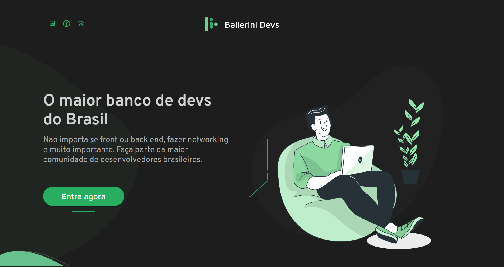

# Challenge Ballerini Devs Completed

## Objetivo
O objetivo foi desenvolver um website utilizando ReactJS que permitisse adicionar, atualizar, listar e deletar desenvolvedores. 

## Tecnologias
Para este desafio eu utilizei o ReactJS e para a estilização utilizei o Styled Components.
Para armazenar os dados dos desenvolvedores usei o localStorage.
